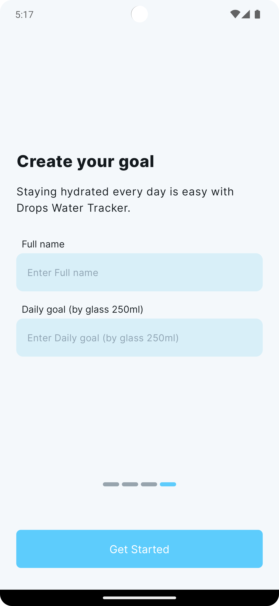
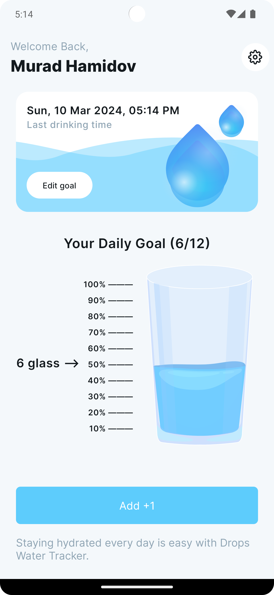
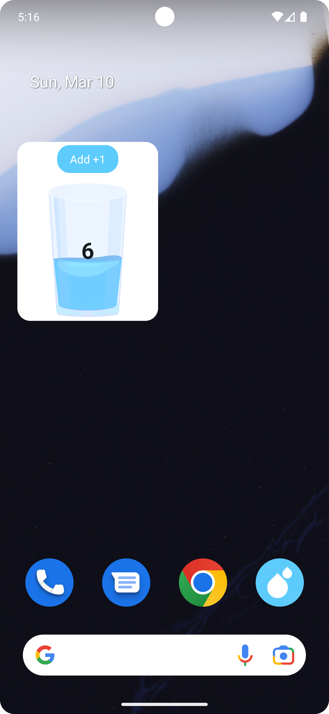

# Drops Water Tracker

Drops Water Tracker is a simple Android app designed to help users track their daily water intake. Set your daily hydration goal, log each glass of water you drink, and even add a convenient widget to your home screen for quick and easy tracking.

## Features

- **Daily Goal:** Set and customize your daily water intake goal.
- **Log Water Consumption:** Log each glass of water you drink to track your progress.
- **Home Screen Widget:** Add a widget to your home screen for convenient, one-tap water tracking.
- **Visual Progress:** Monitor your daily water intake with a visual progress indicator.

## Screenshots






### Clone the repository


   ```bash
   git clone https://github.com/hamidovmurad/drops_water_android
